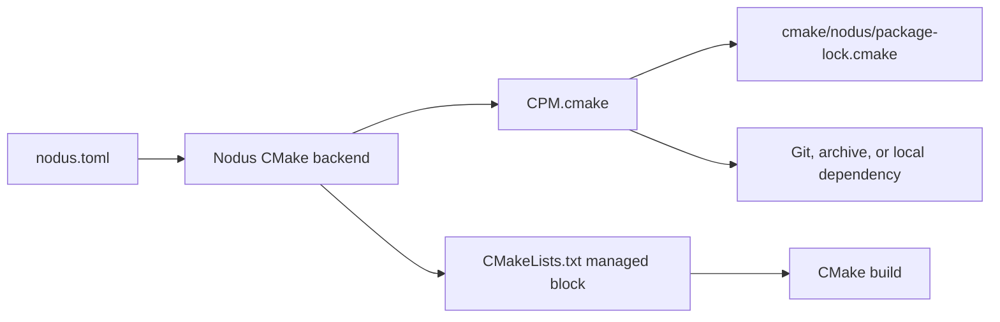
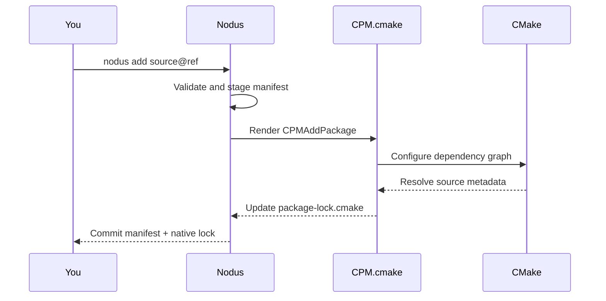

# Nodus

> **0.0.1-alpha.** Nodus is intentionally evolving quickly before its first stable release.

Nodus is a native project companion for C and C++. Its name is Latin for a
**knot**: a visible connection between independent pieces. Nodus helps a project
use dependencies and build tools without taking either one over.

The first backend is CMake, powered by a pinned, vendored copy of
[CPM.cmake](https://github.com/cpm-cmake/CPM.cmake). CPM.cmake handles source
acquisition, caching, CMake options, source integration, and native package
locks. Nodus provides the friendly CLI, project setup, manifest, diagnostics,
and build workflow. Future backends can use the same project model.



## Install

Requirements: Go 1.26+, CMake 3.14+, and Git for Git-backed dependencies.

```bash
git clone https://github.com/Dank-del/nodus.git
cd nodus
go build -o nodus ./cmd/nodus
./nodus about
```

Or install it into your Go bin directory:

```bash
go install github.com/Dank-del/nodus/cmd/nodus@latest
nodus version
```

## Quick start

Create, build, and run a C++ project:

```bash
nodus new hello
cd hello
nodus build
nodus run
nodus test
```

Add a package. Nodus immediately asks CPM.cmake to refresh the native lock:

```bash
nodus add github.com/fmtlib/fmt@11.1.4
nodus link fmt::fmt
nodus build --release
```

For an existing CMake project:

```bash
cd my-app
nodus init
nodus add github.com/nlohmann/json@3.12.0
nodus install
cmake -S . -B build
cmake --build build
```

`nodus init` makes only one managed insertion in `CMakeLists.txt`:

```cmake
# >>> nodus:begin
set(EXTRACTED_CPM_VERSION "0.43.1")
include("${CMAKE_CURRENT_LIST_DIR}/cmake/nodus/CPM.cmake")
CPMUsePackageLock("${CMAKE_CURRENT_LIST_DIR}/cmake/nodus/package-lock.cmake")
include("${CMAKE_CURRENT_LIST_DIR}/cmake/nodus/dependencies.cmake")
# <<< nodus:end
```

Your existing targets stay yours. Use their normal CMake target names in
`target_link_libraries`, or use `nodus link` for projects created with
`nodus new`.

## Dependency sources

Nodus exposes CPM.cmake source modes instead of maintaining its own Git
resolver:

```bash
# GitHub and GitLab shorthand
nodus add github.com/fmtlib/fmt@11.1.4
nodus add gitlab.com/libeigen/eigen@3.4.0

# Any Git remote, branch, tag, or commit
nodus add https://example.com/team/library.git --ref 2.0.0
nodus add git@github.com:owner/library.git#main

# Local source directory or source archive
nodus add ../shared/native-library
nodus add https://example.com/releases/library-1.2.0.tar.gz

# Generic CMake configuration, without per-library special cases
nodus add github.com/example/library@1.0.0 \
  --cmake-option LIBRARY_BUILD_TESTS=OFF \
  --cmake-arg EXCLUDE_FROM_ALL=YES
```

`nodus.toml` records portable user intent. The CMake backend renders
`cmake/nodus/dependencies.cmake`; CPM.cmake then creates the authoritative,
commit-ready `cmake/nodus/package-lock.cmake`.



If configuration fails, Nodus keeps the previous manifest and native lock.
The error is the upstream CMake diagnostic; Nodus does not ship library-specific
workarounds.

## Commands

| Command | Purpose |
| --- | --- |
| `nodus new NAME` | Create a managed C or C++ starter project. |
| `nodus init` | Add Nodus’s managed dependency block to a CMake project. |
| `nodus add/remove` | Change dependencies and update CPM.cmake’s package lock. |
| `nodus install/update` | Configure the locked graph or refresh its native lock. |
| `nodus source`, `link`, `unlink` | Manage the generated project’s sources and linked CMake targets. |
| `nodus build`, `run`, `test` | Friendly CMake and CTest commands. |
| `nodus inspect SOURCE` | Probe a package through the same CMake backend and show discovered targets. |
| `nodus about` | Show Nodus, CPM.cmake, CMake, compiler, and project status. |

Run `nodus --help` or `nodus <command> --help` for flags.

## Project files

```text
my-project/
├── nodus.toml                         # Nodus intent; commit it
├── CMakeLists.txt                     # Yours, with one Nodus block
├── cmake/nodus/
│   ├── CPM.cmake                       # pinned CPM.cmake source; commit it
│   ├── dependencies.cmake              # generated from nodus.toml; commit it
│   └── package-lock.cmake              # CPM.cmake’s native lock; commit it
└── .nodus/                             # local configure state; do not commit
```

## Status and inspection

```bash
nodus about
nodus inspect github.com/nlohmann/json@3.12.0
```

`about` never compiles a project. It reports the selected backend and its
version, CMake and compiler availability, and local project state. `inspect`
does configure a temporary CMake probe, so third-party CMake code may run during
that command.

## License

Nodus is released under the [MIT License](LICENSE). CPM.cmake remains subject
to its own upstream license and notice; its vendored source keeps that notice.

Created by Sayan Biswas ([Dank-del](https://github.com/Dank-del)).
