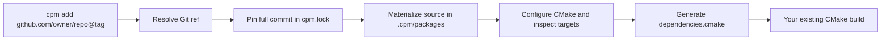
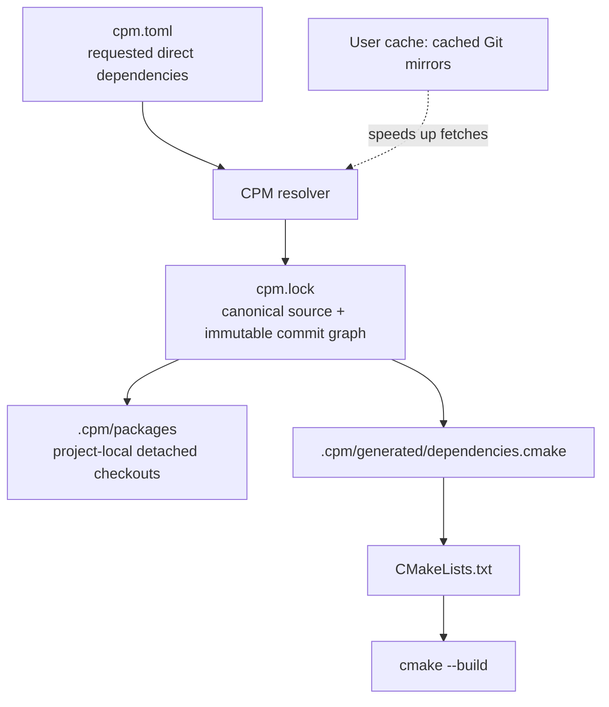

# CPM

> **Pre-release — v0.0.1-alpha.** CPM is under active development. Its CLI,
> manifest, and lockfile formats may change before the first stable release.

CPM is a Git-native C and C++ source dependency manager written in Go. It uses
GitHub repositories as package sources, locks every resolved dependency to a
commit, and generates CMake source integration without requiring upstream
libraries to be repackaged.

## About

Created and maintained by **Sayan Biswas** ([Dank-del on GitHub](https://github.com/Dank-del)).

The goal is a familiar, lightweight workflow for the common case: use a Git
repository directly, pin it immutably, and consume its existing CMake targets
from an existing CMake project.

## What CPM does



CPM currently supports:

- GitHub shorthand, HTTPS, and SSH repository sources.
- Semantic Git tag selection, explicit tags, commits, and branches.
- Commit-pinned `cpm.lock` files and stale-lock protection.
- Transitive dependencies declared by an upstream `cpm.toml`.
- Native CMake projects through `add_subdirectory()`.
- Header-only repositories with a conventional `include/` directory.
- Project-local source/build output with shared Git mirrors in the OS cache.

It does **not** yet support other Git hosts, SemVer ranges, package adapters,
binary packages, arbitrary CMake dependency inference, or cross-compilation.
It is not a replacement for CMake, Conan, or vcpkg.

## Requirements

- Go 1.26 or newer to build CPM from source.
- Git available on `PATH`; CPM intentionally uses your system Git credentials,
  SSH configuration, and credential helpers.
- CMake 3.14 or newer to add or install a CMake dependency. CPM configures the
  package and reads the CMake File API before creating integration metadata.

## Install the CLI

Build from a checkout:

```bash
git clone https://github.com/Dank-del/cpm.git
cd cpm
go build -o cpm ./cmd/cpm
./cpm version
```

Or install it into your Go bin directory:

```bash
go install github.com/Dank-del/cpm/cmd/cpm@latest
export PATH="$(go env GOPATH)/bin:$PATH"
cpm version
```

## Quick start

```bash
mkdir my-app && cd my-app
cpm init
cpm add github.com/fmtlib/fmt@v11.1.4
cpm add github.com/nlohmann/json@v3.11.3
cpm install
```

`cpm init` creates this manifest:

```toml
[project]
name = "my-app"
version = "0.0.1-alpha"

[dependencies]
fmt = "github.com/fmtlib/fmt@v11.1.4"
json = "github.com/nlohmann/json@v3.11.3"
```

After `cpm install`, include the generated file after `project()` in your
top-level `CMakeLists.txt`:

```cmake
cmake_minimum_required(VERSION 3.14)
project(my_app LANGUAGES CXX)

include("${CMAKE_SOURCE_DIR}/.cpm/generated/dependencies.cmake")

add_executable(my_app src/main.cpp)
target_link_libraries(my_app PRIVATE fmt::fmt nlohmann_json::nlohmann_json)
```

Then build your project normally:

```bash
cmake -S . -B build
cmake --build build
```

## How the files fit together



- `cpm.toml` is the human-edited manifest.
- `cpm.lock` is the reproducible, generated source graph. Commit this file.
- `.cpm/` is generated project-local state. Do not commit it.
- The shared cache is an optimization only; it does not affect locked commits.

## Command reference

| Command | Purpose |
| --- | --- |
| `cpm version` | Print the CPM version. |
| `cpm about` | Show CPM/project status plus detected Git, CMake, and C/C++ toolchains. It does not configure or compile a project. |
| `cpm init [--name NAME]` | Create a project manifest. |
| `cpm add [--name ALIAS] SOURCE` | Add, resolve, validate, and lock a dependency. |
| `cpm remove ALIAS` | Remove a direct dependency and rebuild the lock graph. |
| `cpm install` | Materialize exactly the graph in `cpm.lock`. |
| `cpm update [ALIAS...]` | Re-resolve the current manifest. |
| `cpm list` | Show locked packages. |
| `cpm tree` | Show the locked dependency tree. |
| `cpm inspect SOURCE` | Resolve and inspect a remote package and its CMake targets. |
| `cpm clean` | Remove this project’s `.cpm/` artifacts only. |

### Source forms

```bash
cpm add github.com/fmtlib/fmt                 # highest stable SemVer tag
cpm add github.com/fmtlib/fmt@v11.1.4          # exact Git tag
cpm add github.com/owner/project#abc123        # exact commit
cpm add github.com/owner/project#main          # branch, locked to its current commit
cpm add --name fmtlib git@github.com:fmtlib/fmt.git@v11.1.4
```

An unversioned repository resolves to its highest stable semantic version tag.
If it has no semantic tags, CPM resolves the remote default branch and pins the
resulting commit in the lockfile. `cpm install` will never silently move that
commit; use `cpm update` to resolve again.

## CMake integration notes

CPM preserves the targets created by upstream CMake projects. Use the target
names documented by that project, such as `fmt::fmt`. For a repository without
`CMakeLists.txt` that exposes `include/`, CPM generates the interface target
`cpm::<owner>_<repo>`.

Every CMake dependency is configured in an isolated `.cpm/build/` directory.
If configuration fails, CPM stops and preserves `cpm-configure.log` so the
upstream failure can be diagnosed without losing the checkout.

## Development status

`v0.0.1-alpha` is an experimental MVP version line and should not be considered
stable for production workflows. Pin CPM itself to an exact commit or release
tag if you automate it. Until a proper release is announced, breaking changes
are expected.
